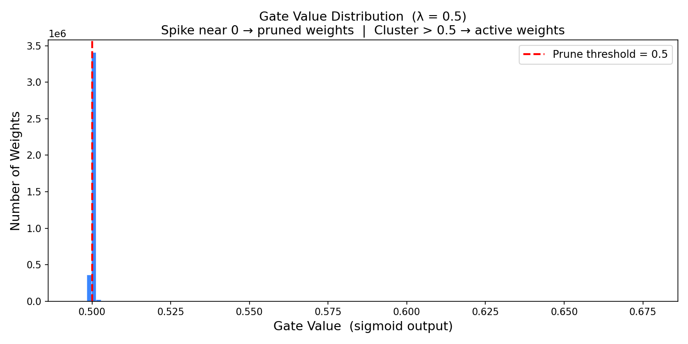

# 🚀 Self-Pruning Neural Network (CIFAR-10)

## 📌 Overview

This project implements a **self-pruning neural network** that automatically removes unnecessary weights during training.

Unlike traditional pruning (done after training), this model **learns which connections to remove while training itself**, improving efficiency without sacrificing accuracy.

---

## 🎯 Objective

To design a neural network that:

* Learns classification on CIFAR-10
* Automatically prunes unimportant weights
* Maintains accuracy with high sparsity

---

## 🧠 Core Idea

Each weight in the network has a **learnable gate**:

* Gate ≈ 1 → Weight is active
* Gate ≈ 0 → Weight is pruned

### 🔧 Forward Pass

```
pruned_weight = weight × sigmoid(gate_scores)
```

### 📉 Loss Function

```
Total Loss = CrossEntropy + λ × Sparsity Loss
```

* Sparsity Loss = mean of all gate values
* λ controls pruning strength

---

## ⚙️ Architecture

* Input: 32×32×3 (CIFAR-10)
* Fully connected network:

  * 3072 → 1024 → 512 → 256 → 10
* Components:

  * Custom `PrunableLinear` layer
  * Batch Normalization
  * Dropout

---

## 📊 Results

| Lambda | Test Accuracy | Sparsity |
| ------ | ------------- | -------- |
| 0.1    | 57.15%        | 69.04%   |
| 0.5    | 57.03%        | 83.36%   |
| 2.0    | 57.18%        | 94.15%   |

### 🔥 Key Insight

Even with **94% of weights pruned**, the model maintains accuracy (~57%), showing that neural networks are highly over-parameterized.

---

## 📈 Gate Distribution

The plot below shows how weights are pruned:

* Large spike near 0 → pruned weights
* Values above 0.5 → active weights



---

## 🛠️ Installation & Setup

### 1. Clone the repository

```
git clone https://github.com/YOUR_USERNAME/tredence-case-study.git
cd tredence-case-study
```

### 2. Create virtual environment

```
python -m venv venv
venv\Scripts\activate
```

### 3. Install dependencies

```
pip install torch torchvision matplotlib numpy
```

---

## ▶️ Run the Project

```
python self_pruning_network.py
```

---

## 📌 Key Learnings

* Neural networks are highly redundant
* L1 regularization encourages sparsity
* Gates can act as differentiable switches
* Model compression can be achieved during training

---

## ❓ Why L1 Regularization?

* L1 has a constant gradient → pushes values to zero
* L2 cannot fully zero out parameters

---

## 👨‍💻 Author

Jagadish V

---

## 📎 Submission Files

* `self_pruning_network.py`
* `REPORT.md`
* `gate_distribution.png`

---

## ⭐ Final Note

This project demonstrates how models can become **smaller, faster, and efficient** without losing performance by learning what to remove.
